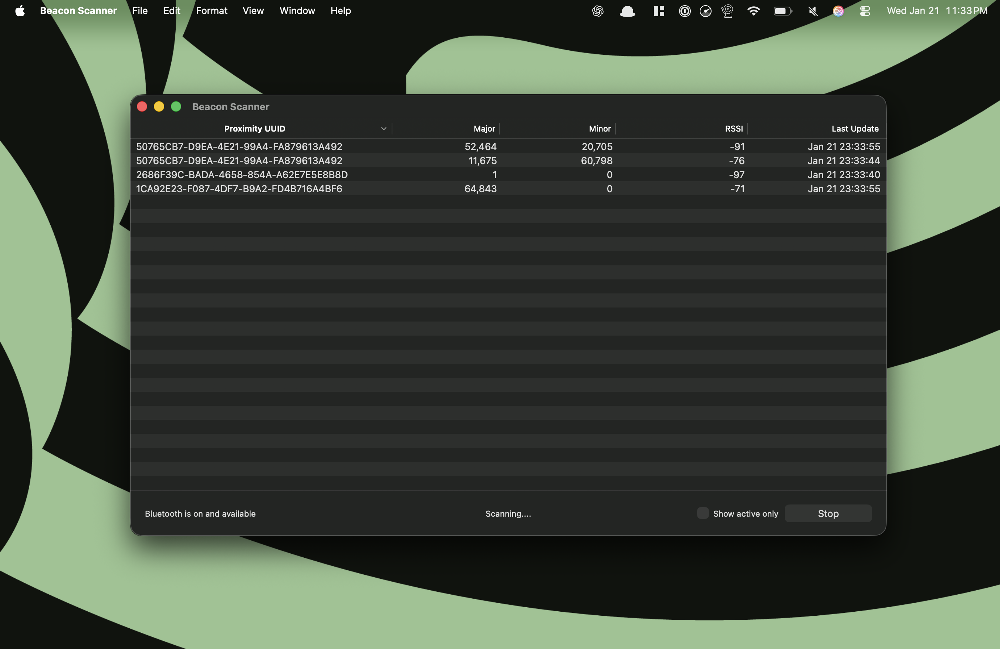

BeaconScanner
=============

iBeacon Scanning Utility for OSX

A notable absence when Apple added iBeacon support to iOS was a lack of both a client API and any utilities for use on the Mac desktop. We authored this utility in an effort to help remedy this.

It provides an easy way to scan for nearby beacons from your Mac. Additionally, the underlying source framework can be used to add iBeacon client support to any other OSX project. 

##How to Install It

To install without building from source, first [download the prebuilt archive](https://github.com/mlwelles/BeaconScanner/releases/latest).  Double click the zip to extract, and then double click again to run. 

Once you start the app it'll automatically begin scanning for bluetooth devices.  Any beacons within range will automatically appear and it will continuously update as long as it remains scanning.

##How to Build It

Building the app requires [cocoapods](http://cocoapods.org).  Once installed, launch Terminal.app and in the project directory, run "pod install".  When it completes, open *BeaconScanner.xcworkspace*  in Xcode.  The app should then build and run successfully. 

##How It Works

The iBeacon protocol is relatively simple.  It is a 25 byte payload that is set as the manufacturer data field of a bluetooth LE advertisment.  The format of this message is as follows:

In order to receive nearby bluetooth advertisements *HGBeaconScanner* instantiances a Core Bluetooth Central manager, and assigns it a dedicated dispatch queue:

	self.managerQueue = dispatch_queue_create("com.huge.DesktopBeacon.centralManagerQueue", NULL);
    self.centralManager = [[CBCentralManager alloc] initWithDelegate:self
                                                               queue:self.managerQueue];

It then asks the Bluetooth Central Manager to start scanning for peripherals:

	[self.centralManager scanForPeripheralsWithServices:nil
                                                options:@{ CBCentralManagerScanOptionAllowDuplicatesKey : @YES}];

The options specify it should should execute a callback everytime it detects any given device. This is important for iBeacons, as their continued detection is the only way to determine if they're still in range. 

In this delegate callback, the beacon scanner determines whether or not a detected peripheral is an iBeacon by trying to parse the iBeacon message from the advertisement data dictionary recieved from the peripheral. If it succeeds it sends a *HGBeacon* object created from the message to its subscribers. 

	- (void)centralManager:(CBCentralManager *)central
	 didDiscoverPeripheral:(CBPeripheral *)peripheral
 	    advertisementData:(NSDictionary *)advertisementData
    	              RSSI:(NSNumber *)RSSI {
    	HGBeacon *beacon = [HGBeacon beaconWithAdvertismentDataDictionary:advertisementData];
	    beacon.RSSI = RSSI;
	    if (beacon) {
    	    [(RACSubject *)self.beaconSignal sendNext:[beacon copy]];
	    }
	}

The parsing of the advertisement data dictionary happens inside *HGBeacon*.  It first seperates the manufacturer data from the advertisement dictionary and then attempts verify and parse this data.  If it succeeds, it returns a new beacon.

Following are the relevant stanzas where this happens:

	+(HGBeacon *)beaconWithAdvertismentDataDictionary:(NSDictionary *)advertisementDataDictionary {
	    NSData *data = (NSData *)[advertisementDataDictionary objectForKey:CBAdvertisementDataManufacturerDataKey];
	    if (data) {
	        return [self beaconWithManufacturerAdvertisementData:data];
	    }
	    return nil;
	}

	+(HGBeacon *)beaconWithManufacturerAdvertisementData:(NSData *)data {
	    if ([data length] != 25) {
	        return nil;
	    }

	    u_int16_t companyIdentifier,major,minor = 0;
	    int8_t measuredPower,dataType, dataLength = 0;
	    char uuidBytes[17] = {0};
	    NSRange companyIDRange = NSMakeRange(0,2);
	    [data getBytes:&companyIdentifier range:companyIDRange];
	    if (companyIdentifier != 0x4C) {
	        return nil;
	    }
	    NSRange dataTypeRange = NSMakeRange(2,1);
	    [data getBytes:&dataType range:dataTypeRange];
	    if (dataType != 0x02) {
	        return nil;
	    }
	    NSRange dataLengthRange = NSMakeRange(3,1);
	    [data getBytes:&dataLength range:dataLengthRange];
	    if (dataLength != 0x15) {
	        return nil;
	    }
	    NSRange uuidRange = NSMakeRange(4, 16);
	    NSRange majorRange = NSMakeRange(20, 2);
	    NSRange minorRange = NSMakeRange(22, 2);
	    NSRange powerRange = NSMakeRange(24, 1);
    	[data getBytes:&uuidBytes range:uuidRange];
	    NSUUID *proximityUUID = [[NSUUID alloc] initWithUUIDBytes:(const unsigned char*)&uuidBytes];
	    [data getBytes:&major range:majorRange];
	    major = (major >> 8) | (major << 8);
	    [data getBytes:&minor range:minorRange];
	    minor = (minor >> 8) | (minor << 8);
	    [data getBytes:&measuredPower range:powerRange];
	    HGBeacon *beaconAdvertisementData = [[HGBeacon alloc] initWithProximityUUID:proximityUUID
	                                                                          major:[NSNumber numberWithUnsignedInteger:major]
	                                                                          minor:[NSNumber numberWithUnsignedInteger:minor]
	                                                                  measuredPower:[NSNumber numberWithShort:measuredPower]];
	    return beaconAdvertisementData;
	}

##Adding Beacon Detection to Your Own Project

To add iBeacon support to your own desktop application (at least until the a proper cocoapod is made available), just copy the following four files into your project:  

- *HGBeaconScanner.h*
- *HGBeaconScanner.m*
- *HGBeacon.h*
- *HGBeacon.m*

The beacon scanner announces the beacons it detects to the subscribers of the [ReactiveCocoa](https://github.com/ReactiveCocoa/ReactiveCocoa) signal that it provides for this.  

All that's needed for a client to detect beacons is to subscribe to this signal:

	[[[HGBeaconScanner] sharedBeaconScanner] startScanning];
	
	RACSignal *beaconSignal = [[HGBeaconScanner sharedBeaconScanner] beaconSignal];
	[beaconSignal subscribeNext:^(HGBeacon *detectedBeacon) {
		NSLog(@"iBeacon Detected: %@", detectedBeacon);
	}];

To limit this subscription to just those beacons that are relevant to your application, a filtered signal can be composed from the raw feed, like so:

	NSUUID *applicationUUID = [[NSUUID alloc] initWithUUIDString:@"B9407F30-F5F8-466E-AFF9-25556B57FE6D"]

	RACSignal *filteredSignal = [[[HGBeaconScanner sharedBeaconScanner] beaconSignal] filter:^(HGBeacon *beacon) {
		return [beaconSignal.proximityUUID isEqual:applicationUUID];
	}];
	

Note that as long as any given beacon is in range, it will be announced periodically via the subscription.  

It's best to use these updates to maintain a seperate list of nearby active beacons, and then periodically purge from this list those that have not been heard from in a while in order to ensure that only active beacons are tracked.   

In the application source, the class *HGBeaconViewController* provides a good example of how to do this. 

## Learn More

An excellent primer is [Adam Warski's post on "How iBeacons work?"](http://www.warski.org/blog/2014/01/how-ibeacons-work/).

The ["What is the iBeacon Bluetooth Profile"](http://stackoverflow.com/questions/18906988/what-is-the-ibeacon-bluetooth-profile) thread on Stack Overflow is also very informative.

In order to turn your OSX Mavericks box into an iBeacon emitter, see Matthew Robinsons' [BeaconOX](https://github.com/mttrb/BeaconOSX).  

## Credits

Portions of *HGBeacon* were derived from a *BLCBeaconAdvertisementData*, by Matthew Robinson and part of [BeaconOX](https://github.com/mttrb/BeaconOSX).

The "Radar" icon image the utility uses was created by [ricaodomaia](http://openclipart.org/user-detail/ricardomaia) and downloaded from [openclipart.org](http://openclipart.org/detail/122719/radar-by-ricardomaia) 